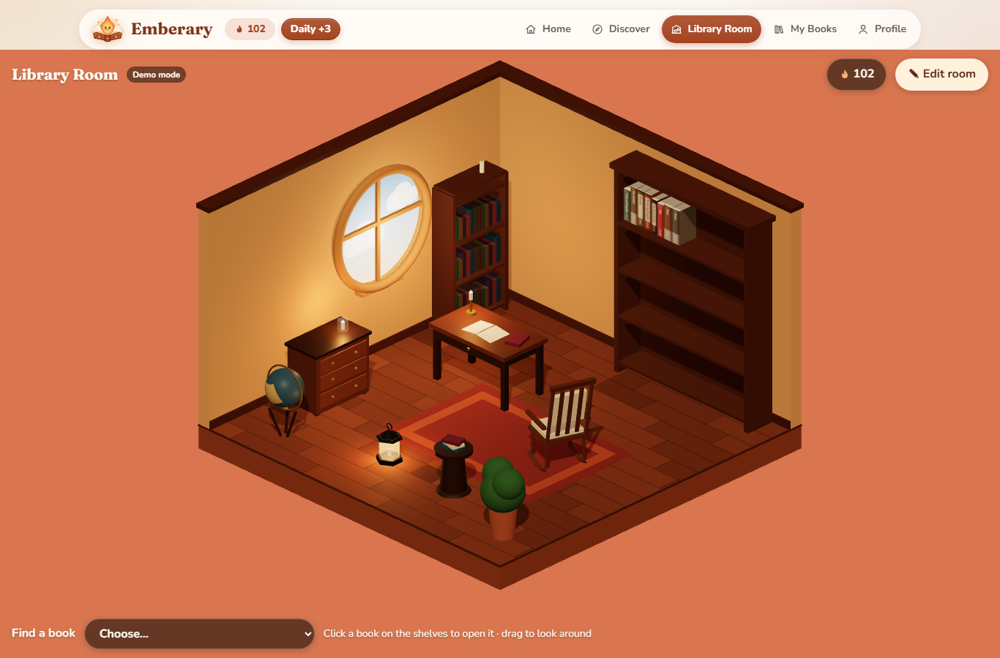

# Emberary

A personal reading space for leisure readers to discover, organize and track
their books, with a 3D Library Room where their collection sits on real shelves.

**Live app:** https://emberary.onrender.com (behind a password, see below)
**Public demo:** https://neriahv.github.io/emberary/ (no login; runs in your browser)
**Health check:** https://emberary.onrender.com/healthz
**Demo video:** to come

The live app is the real thing: React, the Express API and a PostgreSQL
database, all deployed. It sits behind HTTP Basic Authentication, so your
browser asks for a username and password; the grader's login is in my private
course workspace, never in this repository. The first visit after 15 minutes
idle takes about 30 seconds while the free server wakes up.

The public demo is the same interface in [demo mode](#demo-mode): anyone can
try it, and everything stays in their own browser.

## What it does

Week 1 built the complete front end, running in demo mode. Week 2 added the
Express API and PostgreSQL database behind it (see [The API](#the-api)). Week 3
added the Library Room shop and Ember, then deployed the whole app behind an
access gate.

- **Home.** A dashboard with your Currently Reading books and their progress,
  library stats, and rows of covers for recently updated books and
  recommendations
- **Discover.** Search every book on Google Books by title or author, or browse
  by genre, read a book's details, and add it to My Books as Currently Reading,
  Want to Read, Read or Did Not Finish
- **My Books.** Your collection sorted into Currently Reading, Want to Read, Read
  and Did Not Finish. Change a book's status, update your page, rate it, review
  it, or remove it
- **Library Room.** A 3D diorama of a reading room, filling the window below the
  navigation bar: a round window, and every book you have started (reading,
  read, or set aside) standing on the shelves, each spine cut from the book's
  real cover (or, in demo mode, drawn in one of five designs in its colours),
  with its title, so you can find it at a glance. Click a book and it slides off the shelf and
  opens into a two-page spread, the book on the left and your notes on the
  right. **Edit room** opens a shop and lets you arrange the room: put a cart
  together from bookshelves, wallpaper, floors, tables, chairs, lamps, rugs and
  decorations, each shown as a picture of the real thing, and pay for it in
  Ember. Drag furniture across the floor, turn it, or put it in storage, and
  drag any book to any spot on any shelf. Everything is saved
- **Ember.** Emberary's currency, earned by reading: a daily check-in, reading
  20 pages in a day, every 50 pages of a book, and finishing a book. The wallet
  in the navigation bar shows the balance and how to earn more
- **Profile.** Your profile, and insights worked out from your shelves: counts,
  average rating, favourite genres and authors, a ring chart of your yearly goal
  and monthly activity

Every book shows its real cover where one was found (see
[Book covers](#book-covers)), and a drawn cover in its colour otherwise.

## Built with

React 18 and Vite, with React Router for navigation and React Three Fiber
(three.js) for the Library Room. Express 4 and PostgreSQL (through `pg`, with
parameterised queries only) are the back end, tested with Node's built-in test
runner. The deployed app is one Express service on Render, serving the API and
the client behind a password, with `helmet` security headers and a rate limit on
failed logins; the database is on Neon. GitHub Pages keeps a public demo-mode
preview.

## Demo mode

This repository can run two ways, chosen by one environment variable at **build**
time.

**Demo mode is the default.** Only the exact string `false` turns it off, so a
forgotten or mistyped variable leaves you on the simulated backend with a visible
notice rather than on a silently broken build.

| `VITE_USE_MOCK_API` | What happens |
| --- | --- |
| unset, or `true` | The client answers its own requests from `localStorage`. No server, no database, nothing shared between visitors. This is the public demo on GitHub Pages. |
| `false` | The client calls the Express API at `VITE_API_BASE_URL` (or its own address when that is empty, as on Render), which reads and writes real PostgreSQL. This is the live app. |

Demo mode let me build the whole interface in Week 1 before the API existed.
It now stays as a public preview, and as a fallback if the free server is
asleep during a demo. GitHub Pages serves files and cannot run Node, so the
real app runs on Render instead (see [Deploying](#deploying)).

## Running it yourself

**The client only, in demo mode.** No database needed.

    cd client
    npm install
    cp .env.example .env        # VITE_USE_MOCK_API stays true
    npm run dev                 # http://localhost:5173

**The whole stack.** Needs a PostgreSQL, either local or hosted.

    # 1. the database: EITHER with nothing installed
    cd server
    npm install
    npm run db:local            # real PostgreSQL 17 on localhost:5432; leave it running

    #    OR with Docker
    docker run --name my-pg -e POSTGRES_PASSWORD=devpassword \
      -e POSTGRES_DB=emberary -p 5432:5432 -d postgres:17

    # 2. the API
    cd server
    npm install
    cp .env.example .env        # check DATABASE_URL
    npm run db:reset            # creates the tables and adds the demo's books
    npm test                    # optional: resets the database, then tests every endpoint
    npm run dev                 # http://localhost:3000

    # 3. the client, in another terminal
    cd client
    npm install
    cp .env.example .env
    # set VITE_USE_MOCK_API=false
    npm run dev

Check the API on its own before you blame the client:

    curl http://localhost:3000/healthz     # is the process alive
    curl http://localhost:3000/readyz      # is the database reachable
    curl http://localhost:3000/api/books   # the catalogue

`npm run db:local` downloads the official PostgreSQL binaries into
`node_modules` (the `embedded-postgres` package) and keeps its data in
`server/.pgdata`, which is git-ignored. Delete that folder to start from nothing.
It uses the same address and password as `.env.example`, so the default
`DATABASE_URL` works unchanged.

`npm test` refuses to run unless `DATABASE_URL` points at `localhost`, because it
empties the tables before every test. It runs every file in `server/test/`, one
at a time, since two of them reset the same database.

The demo data lives in `client/src/api/seed.json`. After changing it, run
`npm run db:seed:build` in `server/` to regenerate `db/seed.sql`, so both modes
keep starting from the same books, shelves and room.

## Book covers

Covers come from the Google Books API, looked up **once** by a script rather
than on every page load:

    cd server
    # put your key in .env:  GOOGLE_BOOKS_API_KEY=...
    npm run covers:fetch          # books without a cover yet
    npm run covers:fetch -- --all # look every book up again
    npm run covers:fetch -- --db  # also write them into the database DATABASE_URL names

For each catalogue book it finds the edition whose title and author match, and
saves that cover's public image link to `seed.json` (and so `seed.sql`). It also
works out the cover's main colour, which becomes the book's spine colour in the
Library Room. `--db` updates an existing database in place without touching
anyone's shelves, which is how a hosted database gets covers.

**Searching Google Books.** Discover searches every book on Google through the
API (`GET /api/books/search`), which adds the key on the server. A book found
there joins the catalogue when a reader first adds it: the server fetches it from
Google itself, by id, rather than trusting a title or cover sent by the browser.
The demo has no server and no key, so it asks Google directly; when Google's
small keyless quota is used up, it searches its own shelf instead and says so.

**Spines.** The Library Room paints a strip of each book's real cover onto its
spine. 3D graphics may only read images from the page's own address, so the API
passes covers through (`GET /api/covers/:id`), only for covers already in the
catalogue and only from Google's cover host. In demo mode, spines are drawn.

The key is never in a `VITE_` variable, and it is never committed. The saved
image links load without a key, so covers work in demo mode on GitHub Pages too. A book with no
cover, or whose image fails to load, gets a drawn cover instead.

Get a key in the Google Cloud console under **APIs & Services > Credentials**,
enable the Books API, and restrict the key to it.

The cover images belong to their publishers and are served by Google Books; the
site credits Google Books in its footer. None of them are stored in this
repository.

## The API

JSON in, JSON out. Errors come back as `{ "error": "..." }` with a 400 (bad
input), 404 (no such book or entry), 409 (already on your shelves) or 500.
`client/src/api/httpApi.js` calls each of these under the same function name as
the mock.

| Method and path | What it does |
| --- | --- |
| `GET /api/books?q=&genre=` | Search the catalogue by title or author, and filter by genre |
| `GET /api/books/search?q=&genre=` | Search every book on Google Books. Results already in the catalogue come back as the catalogue's book. 502 if Google does not answer |
| `GET /api/books/:id` | One catalogue book |
| `GET /api/covers/:id` | A catalogue book's cover image, passed through from Google, for the Library Room's spines |
| `GET /api/my-books` | Your shelves, newest change first, each entry with its book |
| `GET /api/my-books/:bookId` | One entry on your shelves |
| `POST /api/my-books` | Add `{ bookId, status }`. `status` defaults to `want-to-read`. The reply includes `rewards` |
| `PATCH /api/my-books/:bookId` | Change any of `status`, `currentPage`, `rating`, `review`, `shelfPosition`, `shelfSpot` (`{ bookcase, row, x }` or `null`: where the book stands in the Library Room). The reply includes `rewards`: the Ember this save earned |
| `PUT /api/my-books/order` | Save the order of the books on the shelves: `{ bookIds: [...] }` |
| `DELETE /api/my-books/:bookId` | Take a book off your shelves |
| `GET /api/stats` | Counts by status, average rating, pages read, top genres and authors, books finished per month |
| `GET /api/recommendations?limit=4` | Books you do not own, scored against what you read and rated |
| `GET /api/profile` · `PATCH /api/profile` | `displayName`, `bio`, `yearlyGoal` |
| `GET /api/room` | The Library Room: colours, `wallpaper`, `floor`, the finishes you own (`unlocks`) and every item, placed or stored |
| `PATCH /api/room` | Change any of `wallColor`, `floorColor`, `shelfColor`, and a `wallpaper` or `floor` you own |
| `PATCH /api/room/items/:id` | Move, turn, store or place an item: any of `x`, `z`, `rotation`, `placed` |
| `POST /api/shop/checkout` | Buy a cart, `{ items: [catalogue id, ...] }`, all or nothing. 409 if you cannot afford it |
| `GET /api/ember` | Your balance, today's check-in and pages, the earning rules, and recent history |
| `POST /api/ember/check-in` | The daily check-in. 409 if already claimed today |

The statuses are `currently-reading`, `want-to-read`, `read` and
`did-not-finish`. Marking a book Read moves it to its last page and records when
it was finished, which is what the activity chart counts. Every started book is
on the Library Room shelves; one that joins them from Want to Read goes to the
end, and moving between the other statuses keeps its place.

What the shop sells, and its prices, are in `server/catalog.js` (kept identical
to `client/src/api/catalog.js`, and a test checks they match). A room holds 30
things at once and a reader owns at most 60; the rest wait in storage, and
nothing bought is ever deleted. The floor is 5 by 5 metres centred on 0: `x`
runs from -2.2 (the window wall) to 2.2, and `z` from -2.2 (the bookcase wall) to
2.2; `rotation` is whole degrees from 0 to 359.

**Ember.** Every Ember earned or spent is a row in `ember_ledger`, and the balance
is their sum. One-off rewards (the welcome gift, a daily check-in, a daily goal,
a finished book) have a unique index, so they cannot be paid twice, even by
removing a book and adding it again. Page rewards are counted against what that
book has already earned, so paging back and forth earns nothing. Rewards and
purchases happen inside a transaction with the rows they depend on locked.
"Today" is in `APP_TIMEZONE` (Asia/Manila by default).

Every book includes `coverUrl`, the link to its real cover, or `null` when none
was found.

## Environment variables

None of these are committed. `.env.example` in each folder lists them with
placeholder values.

| Name | Where | What it is |
| --- | --- | --- |
| `DATABASE_URL` | server | PostgreSQL connection string. Contains a password |
| `CORS_ORIGINS` | server | comma-separated origins allowed to call the API |
| `NODE_ENV` | server | `production` on your host; turns on the gate and serves the built client |
| `BASIC_AUTH_USER`, `BASIC_AUTH_PASSWORD` | server, host dashboard only | the access gate's login. The server will not start in production without both |
| `PORT` | server | **set by the host**, do not set it yourself |
| `APP_TIMEZONE` | server, optional | when "today" starts for the daily check-in and reading goal; `Asia/Manila` if unset |
| `GOOGLE_BOOKS_API_KEY` | server: host dashboard and `.env` | searching Google Books from Discover, and `npm run covers:fetch`. Restrict it to the Books API |
| `VITE_USE_MOCK_API` | client, at build time | only `false` turns demo mode off; unset means on |
| `VITE_API_BASE_URL` | client, at build time | your API's public URL, no trailing slash |

Every `VITE_` value is compiled into the built JavaScript and is **public**.
Never put a key, a password or a connection string in one.

## Deploying

**Client, to GitHub Pages.** Already wired up in
`.github/workflows/deploy-pages.yml`. Two one-time steps:

1. **Settings > Pages > Build and deployment > Source: GitHub Actions.** Without
   this the workflow goes green and publishes nothing.
2. Nothing else. No Actions variables are set, so the Pages build stays in demo
   mode.

The repository must be **public** for Pages to serve it on a free account.

The Pages site stays in demo mode on purpose: it is the public preview, and it
never touches the database. The real app is not on Pages, because the access
gate has to sit in front of the website and the API together, on one address.

**The real app: Render and Neon.** One Render web service runs Express, which
serves both the API and the built React client from the same address, behind an
HTTP Basic Authentication gate (`server/basicAuth.js`, `server/web.js`). Same
address means no CORS and one login for everything. The database is on Neon
(PostgreSQL 18; the tests run locally on 17), in Singapore like the server.

| Render setting | Value |
| --- | --- |
| Root directory | *(empty: the repository root)* |
| Build command | `npm run build` (root `package.json`: builds the client, installs the server) |
| Start command | `npm start` |
| Health check path | `/healthz`, the one route outside the gate |
| Environment | `NODE_ENV=production`, `DATABASE_URL` (the app role), `BASIC_AUTH_USER`, `BASIC_AUTH_PASSWORD`, `GOOGLE_BOOKS_API_KEY`, `VITE_USE_MOCK_API=false` |

The database is set up from a laptop, connected as Neon's **owner** role:
`schema.sql`, then `seed.sql` (first setup only: it starts with `TRUNCATE`), then
`roles.sql`. The deployed API connects as `emberary_app`, a role that can read
and write the app's rows but cannot change tables, rewrite the catalogue, or
edit Ember history (`server/test/roles.test.js` checks each of these).

## Project structure

    client/          React front end, built by Vite
      src/api/       ONE interface, two implementations, chosen by a variable
        mockApi.js   the demo backend, stored in localStorage
        httpApi.js   the same functions, calling the Express API
        seed.json    demo books, reading history, profile and room
      src/pages/     Home, Discover, Library Room, My Books, Profile
      src/components/  shared pieces: BookCard, BookCover, BookTile, BookEditForm...
        room/        the 3D diorama (LibraryScene), its furniture and bookcases
                     (models), canvas-drawn spines, wallpapers and floors
                     (textures), the shop's pictures of each piece (thumbnails),
                     the opening book (BookModal) and the shop and edit panel
                     (RoomCustomizer)
        EmberBadge   the wallet in the navigation bar
      src/api/catalog.js  what the shop sells and what Ember is earned for
      src/hooks/     useAsync, the loading/error/ready state every screen uses;
                     useRoomSaver, which saves room changes after a pause;
                     useEmber, the wallet kept up to date
    package.json     build and start commands for the host
    server/          Express API
      app.js         every route, built without listening so tests can run it
      web.js         the deployed app: security headers, the gate, the API
                     and the built client on one address
      basicAuth.js   the access gate
      server.js      reads the environment and starts app.js (or web.js in
                     production)
      validation.js  the same input rules as mockApi.js
      catalog.js     the shop and the Ember rules (identical to the client's)
      repos/         the SQL, one file per area: books, myBooks, insights,
                     profile, room (and the shop's checkout), ember
      db/            pool, schema.sql, seed.sql, roles.sql (the deployed
                     API's permissions) and a runner for them; local.js
                     (npm run db:local), build-seed.js and fetch-covers.js
                     (npm run covers:fetch)
      test/          endpoint tests against a real PostgreSQL, plus the gate,
                     the deployed app and the database role
    compose.yml      only if you self-host
    docs/            planning documents and weekly reports

## Architecture

Every screen imports its data functions from `src/api/index.js`, which picks
`mockApi.js` or `httpApi.js` at build time from `VITE_USE_MOCK_API`. In demo mode
all data stays in the browser's `localStorage`. With the mock off, the client
calls the Express API, which reads and writes PostgreSQL, and the screens do not
change. The Library Room page loads only when opened, because three.js is most of
the app's size.

In the API, each route validates its input (`validation.js`) and then calls a
repository function in `repos/`, which runs one parameterised query. Stats and
recommendations are computed in SQL rather than in JavaScript.

The database has eight tables: `books` (the shared catalogue), `readers`,
`user_books` (one row per reader per book: status, page, rating, review, shelf
position and when it was finished), `room_settings` (the room's colours,
wallpaper and floor), `room_items` (each piece of furniture, with its position,
rotation and whether it is placed or stored), `room_unlocks` (the wallpapers
and floors bought), `ember_ledger` (every Ember earned or spent) and
`reading_days` (pages read per day, for the daily goal). There are no accounts
yet, so the API always acts as reader 1. Every reader-owned row already carries a
`reader_id`, so adding accounts later will not need a migration of every table.

## What I would do next

- Record the demo video
- Add accounts, so each reader's shelves are their own

## Author

Neriah Faith L. Villapaña ([@neriahv](https://github.com/neriahv)).
CS - 401 - Computer Science.

## AI use

Built with Claude Code (Opus 5.5) as the main assistant, and ChatGPT for
rewording. AI wrote most of the interface, the 3D Library Room and the API's
query layer. I wrote the routing, the server entry point, the access gate, the
deployed app's middleware and the database role, and I did the deployment
myself. The full account, entry by entry with commit links, is in
[AI-USAGE.md](AI-USAGE.md).

## Licence

MIT, see [LICENSE](LICENSE).
