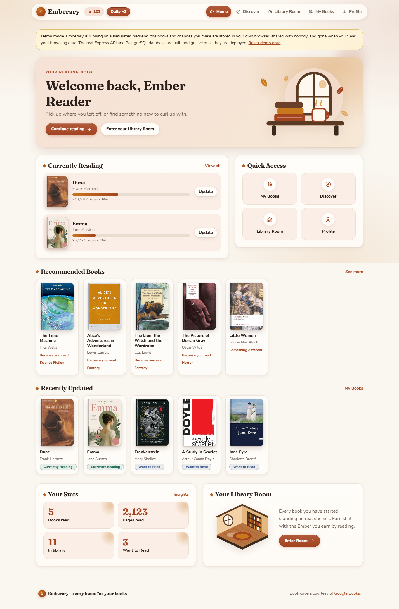
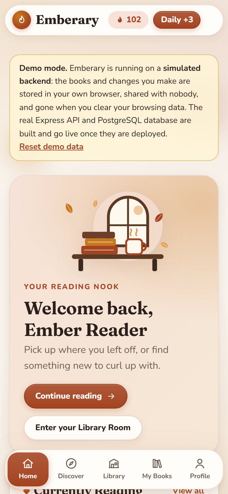
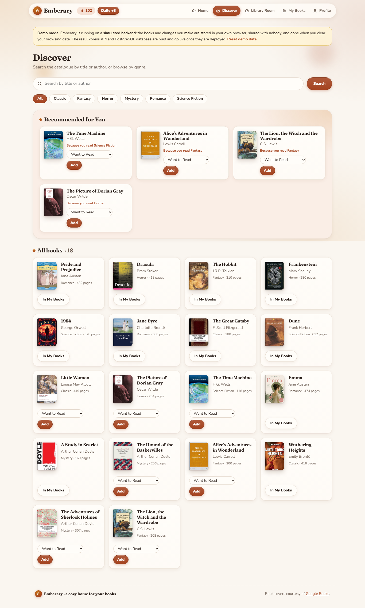
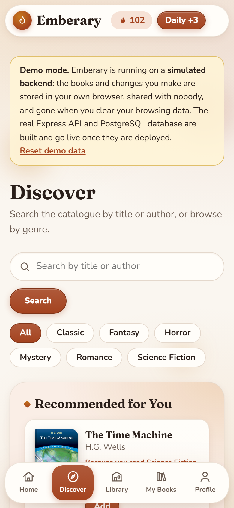
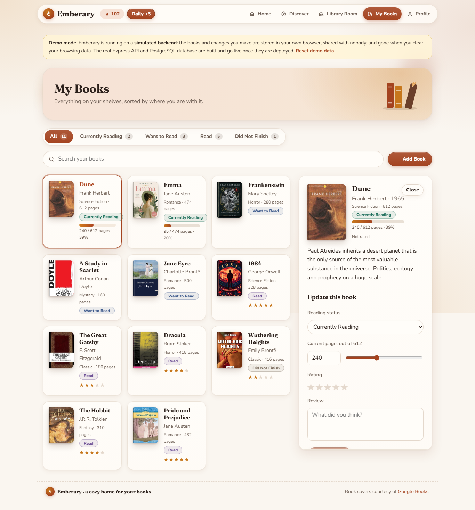
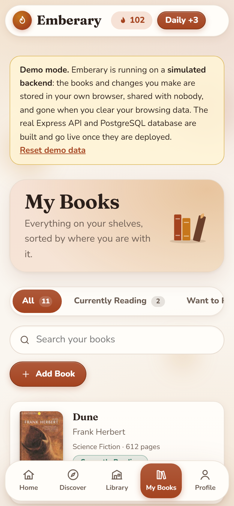
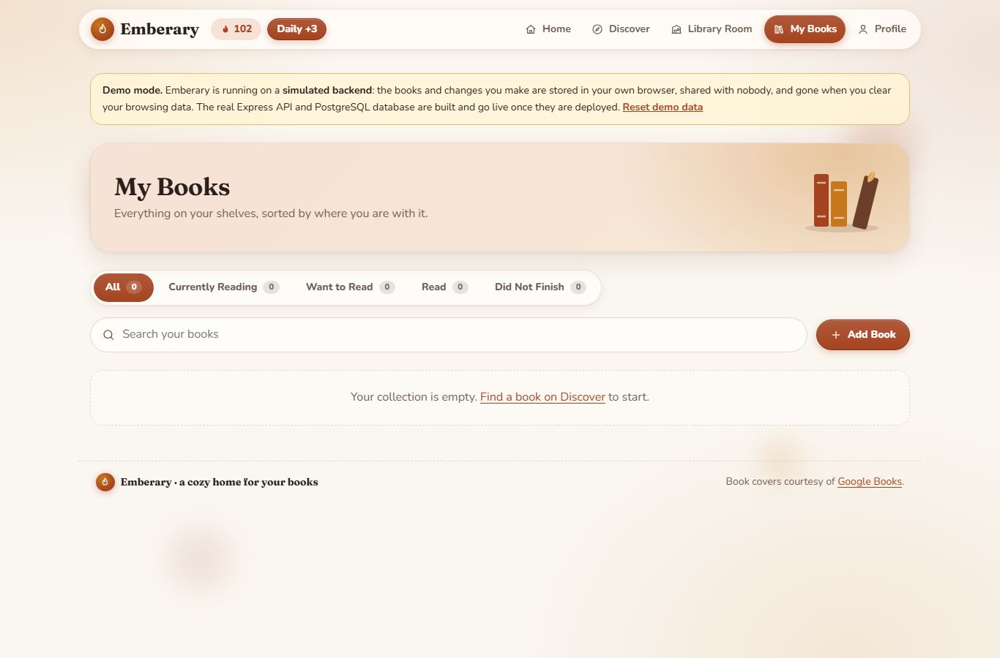
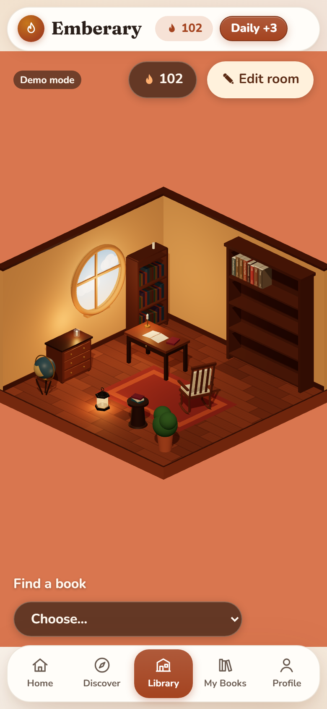
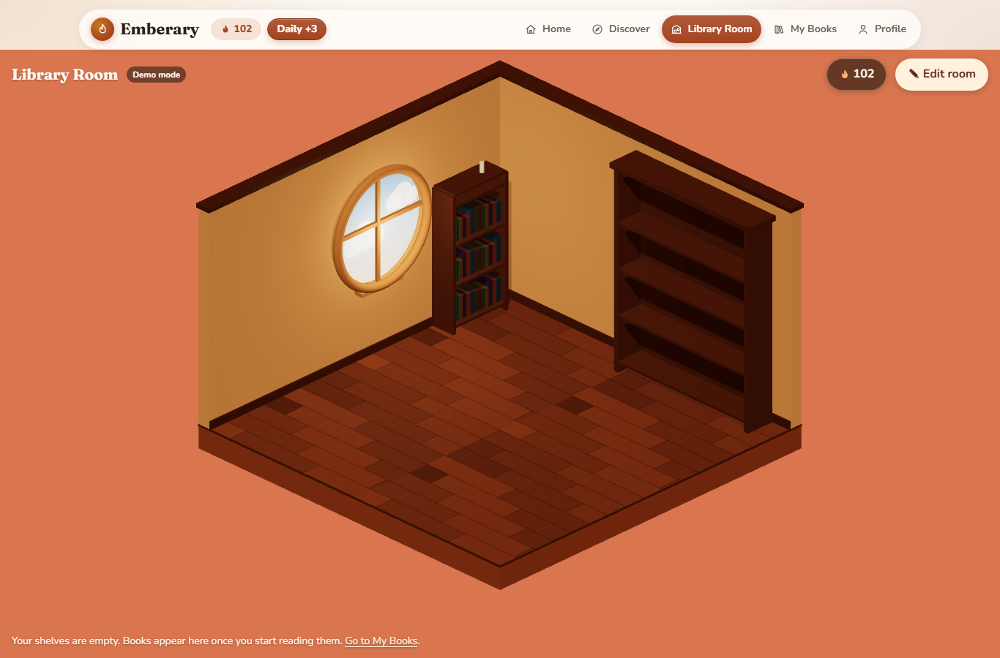
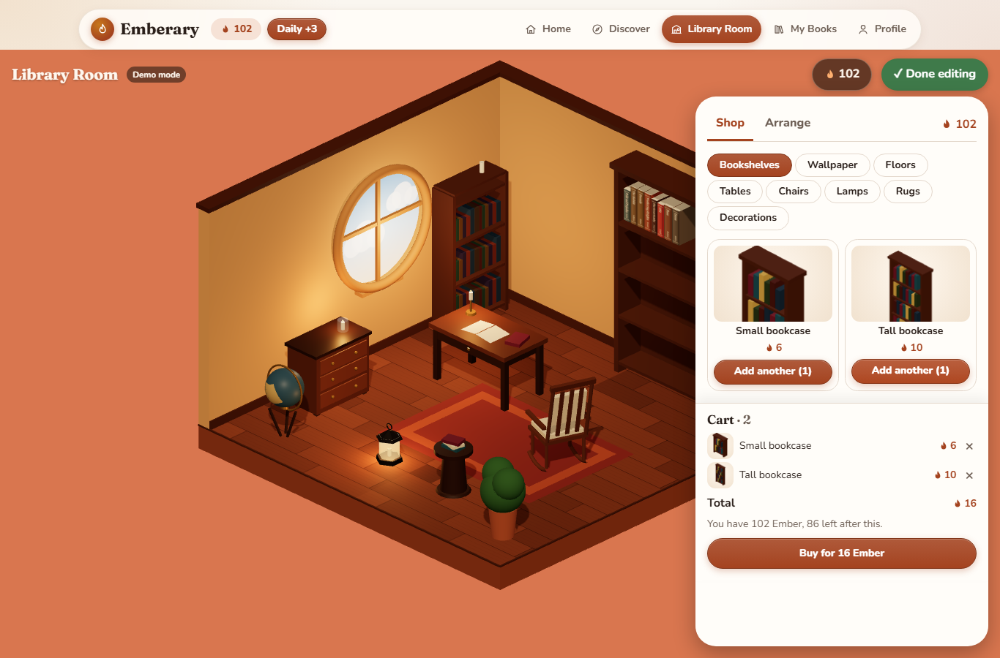

# Mockup

Your prelim wireframes are finished and are not being redone. The mockup below
is what the app actually looks like: the wireframes painted in, with real
colours, type, spacing and content — captured from the running app rather than
described, since a written description of a picture scores in the lowest band.

Every image is in `assets/`, named `mockup-<screen>-<desktop|mobile>.png` (plus
two `-empty.png` shots). Taken in demo mode, the live site's default, so the
data shown is exactly what a first-time visitor sees.

## Home

Laid out like the wireframe: a welcome banner with a "Continue reading" button,
Currently Reading beside Quick Access, rows of covers for recommended and
recently updated books, then Your Stats beside a card that leads into the
Library Room.

## Discover

A search bar with a Search button and genre chips, as in the wireframe, then
personalised recommendations in their own panel, then the full catalogue —
18 real books, each with its real cover.

## My Books

A banner, the status tabs as one segmented control, then a search box and an
**Add Book** button, as in the wireframe. Selecting a book (desktop, above) opens its full
detail panel beside the grid — cover, description, and the form to change
status, page, rating and review. The empty state is what a reader sees before
they've added a single book.

## Library Room

The room fills the whole window below the navigation bar, which stays in place
so the reader can move to any other screen straight from the room: a round
window, the reader's started books standing on the shelves in their own order,
and the furniture the reader has bought and placed. The Ember balance sits in
the navigation bar and at the top of the room.
The empty state (above) is the room with no books and no furniture — the
shelves and the round window are the only things a brand new reader sees.

## What's not in these screenshots

Two things a still image can't show, both of which matter to how the room
actually works:

- Clicking a book on the shelf slides it out and turns it open into a
  two-page spread — a page-turn animation, not a jump cut.
- **Edit room** turns on a mode where furniture can be picked up and dragged
  across the floor directly, not only moved with the sliders visible once an
  item is selected.

The shop in **Edit room**: categories across the top, a picture of each piece
(a photo of the actual 3D model), and a cart that totals the price in Ember and
says how much more is needed when the reader cannot afford it yet.

## Honest note

A few things in the original wireframes did not survive into the built app,
and a few things in the built app go further than the wireframes planned:

- **Cut, then built in Week 3.** Home's welcome banner, Quick Access tiles and
  "Your Library Room" card, Discover's genre chips, My Books' search and Add
  Book button, and the phone's bottom tab bar were all missing from the
  first build. The Week 3 redesign added them, following the wireframe.
- **Still cut.** The "Streak" stat, and Discover's separate "New Releases"
  and "Popular This Week" rows. Home shows books read, pages read, books in
  the library and Want to Read instead of a streak, and Discover has one
  browsing section ("Recommended for You") plus the full catalogue.
- **Restyled in Week 3.** The plain first build became a cozy autumn reading
  nook: rounded cards, pill buttons, warm glows, soft serif headings and
  small illustrations, in the same colour palette (see
  [03-design-system.md](03-design-system.md)).
- **Changed.** The wireframe's Library Room had separate Furniture / Decor /
  Tools categories and explicit Add / Move / Rotate / Remove buttons. The
  built room has one **Edit room** mode instead, with a shop in eight
  categories (closer to the wireframe's idea than its labels): furniture is
  bought with Ember, then dragged, turned or put in storage directly.
- **Changed.** The wireframe's book selection was a view-only info panel. The
  built app opens a whole two-page spread — details on one page, an editable
  status/page/rating/review form on the other — closer to a real book than a
  pop-up.
- **Changed.** Profile's "Reading Progress" line chart and "Favourite Genres"
  pie chart became a bar chart of books finished per month, a ranked list of
  favourite genres and authors, and a new donut/ring chart for the yearly
  reading goal (which the wireframe didn't have at all).
- **Grew beyond the wireframe.** The Library Room itself: the wireframe
  showed a small diagram inside the ordinary page layout. The built room is a
  diorama filling the whole window below the navigation bar, modelled on a
  reference photo, with a round window, cut-away walls, warm lighting, and
  real books whose spines carry their own titles.
- **Changed during the build.** The room first opened as its own full-screen
  view over the navigation bar, with a **Leave room** button to get back out.
  That was replaced: the room now opens under the navigation bar like every
  other page, so the nav bar is the way out and the extra button is gone.
